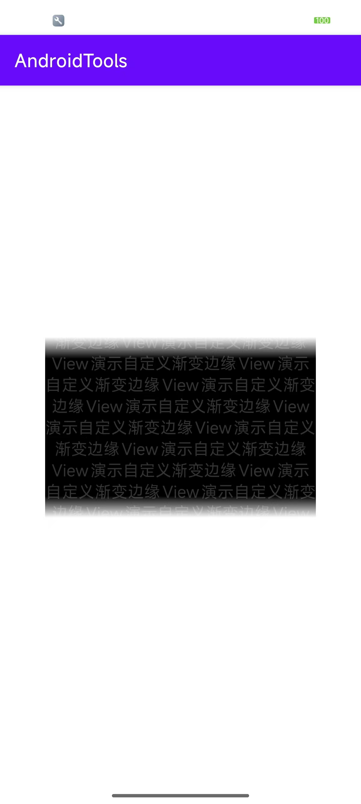

# FadeEdgeView 使用说明

FadeEdgeView 是一个支持四边渐变遮罩效果的自定义 FrameLayout，可用于包裹任意内容并在其边缘显示渐变遮罩。

## 属性说明

- `app:edge_position`：指定需要显示渐变的边（可多选，支持 top、bottom、left、right、all）。
- `app:edge_size`：渐变区域的宽度（dp），上下为高度，左右为宽度。

## XML 示例

```xml
<com.chowziy.atvs.FadeEdgeView
    android:layout_width="300dp"
    android:layout_height="200dp"
    app:edge_position="top|bottom|left|right"
    app:edge_size="24dp">

    <ScrollView
        android:layout_width="match_parent"
        android:layout_height="match_parent">
        <TextView
            android:layout_width="match_parent"
            android:layout_height="wrap_content"
            android:text="FadeEdgeView 渐变演示内容..." />
    </ScrollView>
</com.chowziy.atvs.FadeEdgeView>
```

## 效果截图



## 效果说明

- 渐变区域会覆盖在指定边缘，内容可滑动。
- 渐变宽度可自定义。

## 常见用法

- 用于列表、卡片、弹窗等内容边缘的视觉弱化。
- 可包裹任意 ViewGroup 或单个 View。

---

如需更多高级用法，请参考源码或提交 issue 交流。
